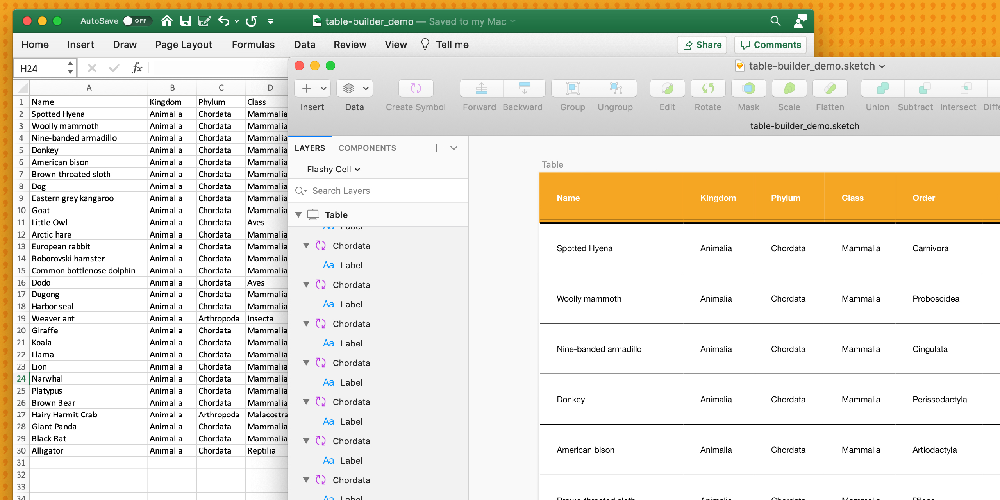

# Sketch Table Builder

Sketch Table Builder (STB) is a very simple plugin that helps you generate tables from a single symbol and a CSV of data.

For each entry in the CSV, STB duplicates your original "cell" symbol, positions it in a grid and assigns the entry data from the CSV to the first text override it finds.

From there you can quite easily batch replace the first row with a different symbol for table headers, or group colums/rows to help modify sizing/layout.

## Installation

1. Download the latest version from the [releases](https://github.com/EricKramp/sketch-table-builder/releases) page.
1. Double-click to install in sketch

## Plugin Usage

1. Select the symbol you want to use as your table "cell"
1. Run "Build Table" from the plugins menu
1. Select the CSV that has the data you would like to fill your table with
1. Viola!

## Development Guide

_This plugin was created using `skpm`. For a detailed explanation on how things work, checkout the [Development Readme](development.md)._
